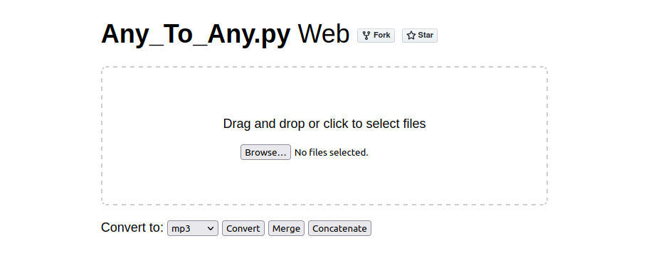

# any_to_any.py - Media File Converter, Merger, Concatenator

- Convert between a wide range of media formats,
- Merge video with audio files,
- Extract audio from video,
- Concatenate files of the same type (audio, video, images),
- Handle batched file processing.



## Setup
1. **Clone/Download**:
   - Use `git clone` or download this repository
2. **Python Version**:
   - Ensure you have Python `3.10.x` or higher installed
3. **Install Dependencies**:
   - Open a terminal from inside the repository and run: `pip install -r requirements.txt`
4. **Running the Script**:
   Use Any_to_Any.py in either of two ways:
   - *Web Interface*
   - *Command Line Interface*

## Web Interface
- Start the web interface: `python any_to_any.py -w`
- Access the web view at `http://localhost:5000` via your browser
- Stop the web interface by pressing `CTRL+C` in the terminal

## Command Line Interface
You can structure a command in three fundamental ways:
- [**Single File Processing**](#single-file-processing)
   - You can convert,
   - You can't merge or concatenate with only one file.
- [**Directory Processing**](#directory-processing)
   - You can convert,
   - You can merge and concatenate files, if multiple are present.
- [**Multi Directory/File Processing**](#multi-directoryfile-processing)
   - You can convert,
   - You can merge or concatenate per input directory, or across them.

### Parameters

| Command Argument             | Meaning |
| ---------------------------- | ------- |
| `-h` or </br>`--help`        | List all available parameters, their description and default values, then exit. |
| `-i` or </br>`--input`       | Path to file itself or directory containing files to be converted. If not provided, the directory from where the script is called will be used. |
| `-f` or </br>`--format`      | Desired output file format, either `mp2`, `mp3`, `flac`, `wav`, `aac`, `aiff`, `ogg`, `oga`, `m4a`, `ac3`, `dts`, `weba`, `wma`, `mka`, `wv`, `caf`, `tta`, `m4b`, `eac3`, `spx`, `au`, `opus`, `m3u8`, `w64`, `mlp`, `adts`, `sbc`, `thd`, `jpg`, `png`, `gif`, `bmp`, `pdf`, `webp`, `tiff`, `tga`, `eps`, `ps`, `ico`, `eps`, `jpeg2000`, `im`, `pcx`, `ppm`, `mp4`, `webm`, `mov`, `mkv`, `avi`, `wmv`, `flv`, `m2ts`, `3gp`, `3g2`, `mjpeg`, `asf`, `vob`, `ts`, `raw`, `mpg`, `mxf`, `drc`, `swf`, `f4v`, `m4v`, `mts`, `m2v`, `yuv` or movie codecs like `h263p`, `h264`, `h265`, `xvid`, `mpeg1`, `mpeg2`, `mpeg4`, `av1`, `avc`, `theora`, `vp8`, `vp9`, `hevc`, `prores`, `huffyuv`, `ffv1`, `ffvhuff`, `v210`, `v410`, `v308`, `v408`, `zlib`, `qtrle`, `snow`, `svq1`, `utvideo`, `cinepak`, `msmpeg4`, `h264_nvenc`, `vpx`, `h264_rgb`, `mpeg2video`, `prores_ks`, `vc2` and `flv1` |
| `-o` or </br>`--output`      | Directory to save converted files into. Writing to the input file path, if none provided. |
| `-q` or </br>`--quality`     | Set output file quality, either `low`, `medium`, or `high`; default is same as input. |
| `-m` or </br>`--merge`       | Merge movie file with equally named audio file to become its audio track. |
| `-c` or </br>`--concat`      | Concatenate input files of the same type (images, audio, video) into one output file (e.g. `concatenated_video.mp4` for movie files, `concatenated_audio.mp3` for audio files). |
| `-a` or </br>`--across`      | Merge/Concatenate across directories when multiple directories are provided. |
| `-w` or </br>`--web`         | Ignores all other arguments, starts browser + a web server at `http://localhost:5000`. |
| `-d` or </br>`--delete`      | Delete input files after conversion. |
| `-fps` or</br>`--framerate`  | Set the framerate (fps) when converting to a movie format or codec; default maintains input fps. |

### Single File Processing
Convert a WEBP file to PNG:
```python
python any_to_any.py -i /path/to/file.webp -f png
```

Convert MP4 to MP3, delete the MP4 source file afterwards:
```python
python any_to_any.py -i /path/to/file.mp4 -f mp3 -d
```

Convert MP3 to M4A, set conversion quality to high, delete the MP3 source file afterwards:
```python
python any_to_any.py -i /path/to/file.mp3 -f m4a -q high -d
```

### Directory Processing
Directory Processing is useful when you want to work with multiple files in a directory

Convert all WEBP files in a directory to PNG:
```python
python any_to_any.py -i /path/to/webp-folder -f png
```

Convert all MP4 files to MP3, save to a different directory, set conversion quality to `high`, delete MP4 source files afterwards:
```python
python any_to_any.py -i /path/to/mp4-folder -o /path/to/save/folder -f mp3 -q high -d
```

Merge MP4 files with respective, equally named MP3 files in the same directory, save to a different directory, delete source files afterwards:
```python
python any_to_any.py -i /path/to/folder -o /path/to/save/folder -m -d
```

Concatenate MP4 files, save to a different directory, delete source files afterwards:
```python
python any_to_any.py -i /path/to/mp4-folder -o /path/to/save/folder -c -d
```

### Multi Directory/File Processing
You can also process multiple individual files or multiple directories at once.<br>
Note that only one output directory can be specified (omitting the `-o`/`--output` parameter works and will write to the input file paths).
```python
python any_to_any.py -i -1 /path/to/file1.mp4 -2 /path/to/mp4-folder -o /path/to/output-folder -f mp3
```
Merging across directories works when adding `-a`/`--across` to the `-m`/`--merge` parameter:
```python
python any_to_any.py -i -1 /path/to/folder1 -2 /path/to/folder2 -o /path/to/output-folder -m -a
```
Concatenating across directories works when adding `-a`/`--across` to the `-c`/`--concat` parameter:
```python
python any_to_any.py -i -1 /path/to/folder1 -2 /path/to/folder2 -o /path/to/output-folder -c -a
```
Omitting the `-a`/`--across` parameter will execute merges or concatenations seperately, per each input directory.

## Supported Formats
**Audio:** MP2, MP3, FLAC, AAC, AC3, DTS, OGG, OGA, WMA, WAV, M4A, AIFF, WEBA, MKA, WV, CAF, TTA, M4B, EAC3, SPX, AU, OPUS, M3U8, W64, MLP, ADTS, SBC, THD<br><br>
**Image:** JPG, PNG, GIF, BMP, WEBP, TIFF, TGA, EPS, PS, ICO, EPS, JPEG2000, IM, PCX, PPM<br><br>
**Document:** PDF<br><br>
**Video:** MP4, WEBM, MOV, MKV, AVI, WMV, FLV, MJPEG, M2TS, 3GP, 3G2, ASF, VOB, TS, RAW, MPG, MXF, DRC, SWF, F4V, M4V, MTS, M2V, YUV<br><br>
**Video Codec:** AV1, AVC, VP8, VP9, H263P, H264, H265, XVID, MPEG2, MPEG4, THEORA, MPEG1, HEVC, PRORES, HUFFYUV, FFV1, FFVHUFF, V210, V410, V308, V408, ZLIB, QTRLE, SNOW, SVQ1, UTVIDEO, CINEPAK, MSMPEG4, H264_NVENC, VPX; H264_RGB, MPEG2VIDEO, PRORES_KS, VC2, FLV1

## License
This project is licensed under the MIT License.

## Contributions
Contributions and feedback are welcome. Feel free to open issues or pull requests.

## Disclaimer
This script is provided as-is, without any warranties or guarantees.<br>
Users are responsible for ensuring compliance with applicable laws and regulations.
