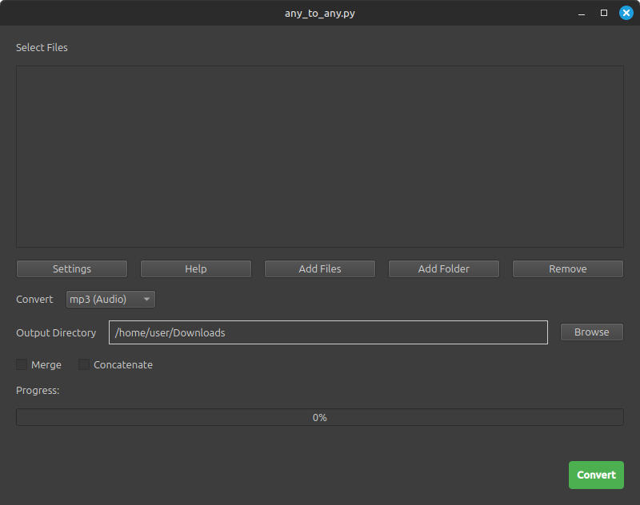

# any_to_any.py - Universal media converter: audio, video, images, docs - GUI • Web UI • CLI


- **Convert** between a wide range of media formats (audio, video, image, document)
- **Merge** video files with separate audio files
- **Extract** audio tracks from video files
- **Concatenate** multiple files of the same type (audio, video, images)
- Process **single files, entire directories (recursively if desired), or multiple specified inputs**
- Merge or concatenate files **within individual directories or across multiple directories**
- Offering a flexible **Command Line Interface**, a **Web Interface**, and a **Graphical User Interface (GUI)**
- Control output quality and video framerate for the conversion
- Automatically monitor a **"dropzone" directory** for new files and process them as they are dropped
- Fast batch conversion with configurable **parallel processing** for audio and video conversions

## Setup
1. **Clone/Download**:
   - Download this repository or run `git clone https://github.com/MK2112/any_to_any.py.git`
2. **Python Version**:
   - Ensure you have Python `3.10.x` or higher installed
3. **Install Dependencies**:
   - Open a terminal from inside the repository and run: `pip install -r requirements.txt`
4. **Running the Script**:
   Use Any_to_Any.py in any of three ways (click for details):
   - [*Command Line Interface*](#command-line-interface)
   - [*Web Interface*](#web-interface)
   - [*Graphical User Interface (GUI)*](#graphical-user-interface-gui)

## Web Interface
- Start the web interface: `python any_to_any.py -w`
- Access the web view at `http://localhost:5000` via your browser
- Stop the web interface by pressing `CTRL+C` in the terminal

## Graphical User Interface (GUI)

The GUI is intended for users who want a great UX for `any_to_any.py` without requiring a browser.

- Drag and drop files or folders for instant batch conversion
- Select output format, directory, and advanced options
- Merge, concatenate, or extract as easily as with the CLI/web
- Multi-language support

**Install GUI-related additional dependencies:**
```bash
pip install -r requirements_gui.txt
```

**Launch the GUI:**
```bash
python gui/qt_app.py
```

If you want to build a standalone executable for Windows/Linux/macOS, ideally install and use UPX:
```bash
python gui/build.py
```

<p align="center">
   
</p>

## Command Line Interface

This is the most detailed way to use `any_to_any.py`. You can structure a command in three fundamental ways:
- [**Single File Processing**](#single-file-processing)
   - You can convert,
   - You can't merge or concatenate with only one file.
- [**Directory Processing**](#directory-processing)
   - You can convert,
   - You can merge and concatenate files, if multiple are present.
- [**Multi Directory/File Processing**](#multi-directoryfile-processing)
   - You can convert,
   - You can merge or concatenate per input directory, or across them.

### Parameters

| Command Argument             | Meaning |
| ---------------------------- | ------- |
| `-h` or </br>`--help`        | List all available parameters, their description and default values, then exit. |
| `-l` or </br>`--language`    | Set the CLI language, currently supported: `zh_CN` (Mandarin, Simplified), `ja_JP` (Japanese), `fr_FR` (French), `es_ES` (Spanish), `it_IT` (Italian), `de_DE` (German), `pt_BR` (Portuguese, Brazilian), `uk_UA` (Ukrainian), `ko_KR` (Korean), `en_US` (American English), `pl_PL` (Polish), `hi_IN` (Hindi), `ru_RU` (Russian), `ar_SA` (Arabic), `id_ID` (Indonesian), `tr_TR` (Turkish), `vi_VN` (Vietnamese), `th_TH` (Thai), `nl_NL` (Dutch), `sv_SE` (Swedish), `da_DK` (Danish), `fi_FI` (Finnish), `no_NO` (Norwegian), `is_IS` (Icelandic), `he_IL` (Hebrew), `cs_CZ` (Czech), `ro_RO` (Romanian), `ms_MY` (Malay), `bg_BG` (Bulgarian), `hu_HU` (Hungarian), `el_GR` (Greek), `sk_SK` (Slovak), `zh_TW` (Mandarin, Traditional), `fa_IR` (Persian, Farsi), `ur_PK` (Urdu), `sw_TZ` and `sw_KE` (Swahili), `pa_IN` and `pa_PK` (Punjabi). **Fallback is `en_US`.** |
| `-i` or </br>`--input`       | Path to file itself or directory containing files to be converted. If not provided, the directory from where the script is called will be used. |
| `-f` or </br>`--format`      | Desired output file format, either `mp2`, `mp3`, `flac`, `wav`, `aac`, `aiff`, `ogg`, `oga`, `m4a`, `ac3`, `dts`, `weba`, `wma`, `mka`, `wv`, `caf`, `tta`, `m4b`, `eac3`, `spx`, `au`, `opus`, `m3u8`, `w64`, `mlp`, `adts`, `sbc`, `thd`, `jpeg`, `png`, `gif`, `bmp`, `pdf`, `docx`, `pptx`, `srt`, `webp`, `tiff`, `tga`, `eps`, `ps`, `ico`, `eps`, `jpeg2000`, `im`, `pcx`, `ppm`, `mp4`, `webm`, `mov`, `mkv`, `avi`, `wmv`, `flv`, `m2ts`, `3gp`, `3g2`, `mjpeg`, `asf`, `vob`, `ts`, `raw`, `mpg`, `mxf`, `drc`, `swf`, `f4v`, `m4v`, `mts`, `m2v`, `yuv`, movie codecs like `h263p`, `h264`, `h265`, `xvid`, `mpeg1`, `mpeg2`, `mpeg4`, `av1`, `avc`, `theora`, `vp8`, `vp9`, `hevc`, `prores`, `huffyuv`, `ffv1`, `ffvhuff`, `v210`, `v410`, `v308`, `v408`, `zlib`, `qtrle`, `snow`, `svq1`, `utvideo`, `cinepak`, `msmpeg4`, `h264_nvenc`, `vpx`, `h264_rgb`, `mpeg2video`, `prores_ks`, `vc2`, `flv1`, or protocols like `hls` and `dash` |
| `-o` or </br>`--output`      | Directory to save converted files into. Writing to the input file path, if none provided. |
| `-q` or </br>`--quality`     | Set output file quality, either `low`, `medium`, or `high`; default is same as input. |
| `-m` or </br>`--merge`       | Merge movie file with equally named audio file to become its audio track. |
| `-c` or </br>`--concat`      | Concatenate input files of the same type (images, audio, video) into one output file (e.g. `concatenated_video.mp4` for movie files, `concatenated_audio.mp3` for audio files). |
| `-s` or </br>`--split`       | Split a PDF into multiple files, either by page count or page ranges, e.g. `1-2,3-5` or `10` or `1-3,2-6,8-end` or `1-5,rest`. |
| `-a` or </br>`--across`      | Merge/Concatenate across directories when multiple directories are provided. |
| `-w` or </br>`--web`         | Ignores all other arguments, starts browser + a web server at `http://localhost:5000`. |
| `-d` or </br>`--delete`      | Delete input files after conversion. |
| `-r` or </br>`--recursive`   | Recursively process all input files in subdirectories from the input directory. Outputs by default will be placed in their respective subdirectory, unless different output path provided. |
| `-z` or </br>`--dropzone`    | While running, a specified directory will be monitored for new files. When a file is added, it will be converted to the specified format, saved in the output directory and deleted from the input directory. |
| `-fps` or</br>`--framerate`  | Set the framerate (fps) when converting to a movie format or codec; default maintains input fps. |
| `--workers`                   | Set the maximum number of parallel worker threads for per-file conversions (`1` to `cpu_count - 1` are supported). Defaults to `1`. |

### Single File Processing
Convert a WEBP file to PNG:
```python
python any_to_any.py -i /path/to/file.webp -f png
```

Convert MP4 to MP3, delete the MP4 source file afterwards:
```python
python any_to_any.py -i /path/to/file.mp4 -f mp3 -d
```

Convert MP3 to M4A, set conversion quality to high, delete the MP3 source file afterwards:
```python
python any_to_any.py -i /path/to/file.mp3 -f m4a -q high -d
```

Convert MP4 to HLS streams:
```python
python any_to_any.py -i /path/to/file.mp4 -f hls
```
The option for `hls` creates a directory with distinct folders for stream fragments of resolutions `426x240`, `640x360`, `842x480`, `1280x720`, and `1920x1080`.

If you feel like it, you can even convert an MP4 file to a PDF, that PDF to a GIF and the GIF back to MP4:
```python
# Create the PDF containing the movie's frames [Movie -> Document]
python any_to_any.py -i /path/to/file.mp4 -f pdf
# Create the GIF from your PDF [Document -> Image]
python any_to_any.py -i /path/to/file.pdf -f gif
# Create the MP4 from your GIF again [Image -> Movie]
python any_to_any.py -i /path/to/file.gif -f mp4
```

You may also convert the images contained in a DOCX file to an MP4 video:
```python
python any_to_any.py -i /path/to/file.docx -f mp4
```

Split a PDF into multiple files, either by page count or page ranges, e.g. `1-2,3-5` or `10` or `1-3,2-6,8-end` or `1-5,rest`:
```python
python any_to_any.py -i /path/to/file.pdf -s 1-3,2-6,8-end
```

### Directory Processing
Directory Processing is useful when you want to work with multiple files in a directory

Convert all WEBP files in a directory to PNG:
```python
python any_to_any.py -i /path/to/webp-folder -f png
```

Convert all MP4 files to MP3, save to a different directory, set conversion quality to `high`, delete MP4 source files afterwards:
```python
python any_to_any.py -i /path/to/mp4-folder -o /path/to/save/folder -f mp3 -q high -d
```

Convert all MP3 files from any subdirectory **recursively** to M4A, delete MP3 source files afterwards:
```python
python any_to_any.py -i /path/to/mp3-top-folder -f m4a -d -r
```

Merge MP4 files with respective, equally named MP3 files in the same directory, save to a different directory, delete source files afterwards:
```python
python any_to_any.py -i /path/to/folder -o /path/to/save/folder -m -d
```

Concatenate MP4 files, save to a different directory, delete source files afterwards:
```python
python any_to_any.py -i /path/to/mp4-folder -o /path/to/save/folder -c -d
```

### Dropzone Mode
You can turn a folder on your system into a "dropzone" for files to be converted.<br>
Once a file is dropped into the folder, it will be converted to a specified format and saved in an output directory.<br>
The dropped, original file will be deleted after conversion.

To set up a dropzone, specify:
- The input directory with `-i`/`--input`, 
- The output directory with `-o`/`--output`,
- The desired format to convert to with `-f`/`--format`,
- The `-z`/`--dropzone` parameter.

For example, this sets up a dropzone to convert files to MP3, saving them in the output directory:
```python
python any_to_any.py -i /path/to/dropzone -o /path/to/save_folder -f mp3 -z
```

The script will run continuously, monitoring the input directory for new files.
This runs continuously, halt it by pressing `CTRL+C`.

### Multi Directory/File Processing
You can also process multiple individual files or multiple directories at once.<br>
Note that only one output directory can be specified (omitting the `-o`/`--output` parameter works and will write to the input file paths).
```python
python any_to_any.py -i -1 /path/to/file1.mp4 -2 /path/to/mp4-folder -o /path/to/output-folder -f mp3
```
Merging across directories works when adding `-a`/`--across` to the `-m`/`--merge` parameter:
```python
python any_to_any.py -i -1 /path/to/folder1 -2 /path/to/folder2 -o /path/to/output-folder -m -a
```
Concatenating across directories works when adding `-a`/`--across` to the `-c`/`--concat` parameter:
```python
python any_to_any.py -i -1 /path/to/folder1 -2 /path/to/folder2 -o /path/to/output-folder -c -a
```
Omitting the `-a`/`--across` parameter will execute merges or concatenations seperately, per each input directory.

#### Parallel Processing
- Per-file conversions (e.g., audio-to-audio, movie-to-movie, gif-to-video) are processed in parallel.
- Override default (`1` worker) by setting `--workers N` where `N` can be any integer from `1` to `cpu_count - 1`.

Directory with many audio files:
```bash
python any_to_any.py -i /path/to/folder -f mp3 --workers 4
```
Explicit multiple files:
```bash
python any_to_any.py -i /path/to/a.wav /path/to/b.flac /path/to/c.ogg -f mp3 --workers 4 -o /path/to/output_dir
```
Recursive scan (include subdirectories):
```bash
python any_to_any.py -i /path/to/input_dir -f mp3 --workers 4 --recursive
```

## Supported Formats
**Audio:** MP2, MP3, FLAC, AAC, AC3, DTS, OGG, OGA, WMA, WAV, M4A, AIFF, WEBA, MKA, WV, CAF, TTA, M4B, EAC3, SPX, AU, OPUS, M3U8, W64, MLP, ADTS, SBC, THD<br><br>
**Image:** JPEG, PNG, GIF, BMP, WEBP, TIFF, TGA, EPS, PS, ICO, EPS, JPEG2000, IM, PCX, PPM<br><br>
**Document:** PDF, DOCX, PPTX, SRT<br><br>
**Video:** MP4, WEBM, MOV, MKV, AVI, WMV, FLV, MJPEG, M2TS, 3GP, 3G2, ASF, VOB, TS, RAW, MPG, MXF, DRC, SWF, F4V, M4V, MTS, M2V, YUV<br><br>
**Video Codec:** AV1, AVC, VP8, VP9, H263P, H264, H265, XVID, MPEG2, MPEG4, THEORA, MPEG1, HEVC, PRORES, HUFFYUV, FFV1, FFVHUFF, V210, V410, V308, V408, ZLIB, QTRLE, SNOW, SVQ1, UTVIDEO, CINEPAK, MSMPEG4, H264_NVENC, VPX; H264_RGB, MPEG2VIDEO, PRORES_KS, VC2, FLV1<br><br>
**Protocols:** HLS, DASH

## License
MIT.

## Contributions
Contributions and feedback are welcome. Feel free to open issues or pull requests.

## Disclaimer
This script is provided as-is, without any warranties or guarantees.<br>
Users are responsible for ensuring compliance with applicable laws and regulations.
